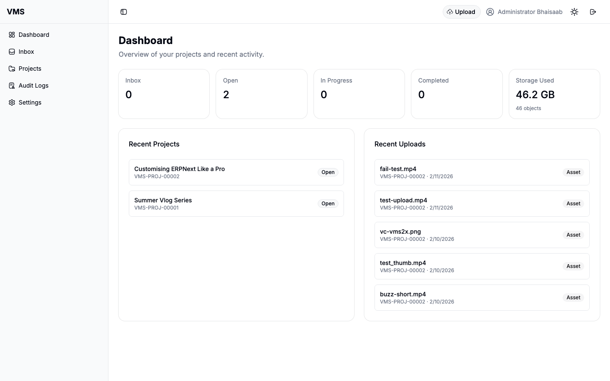
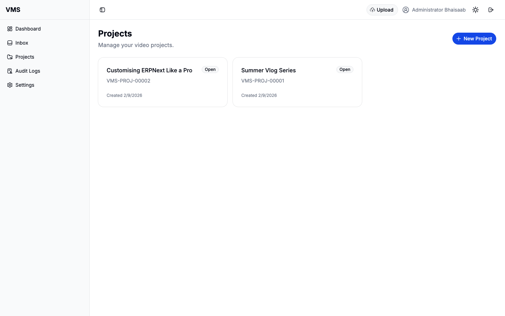
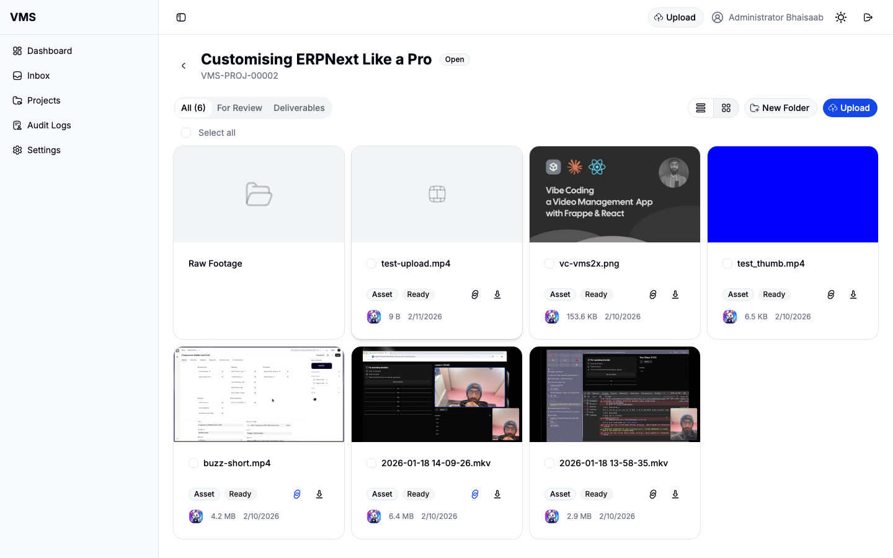
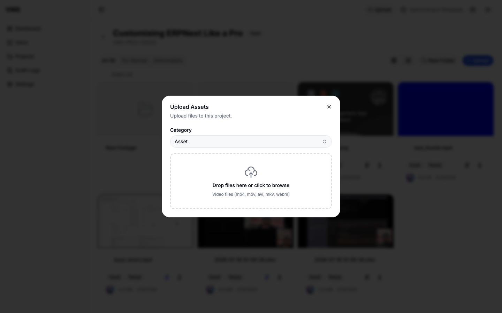
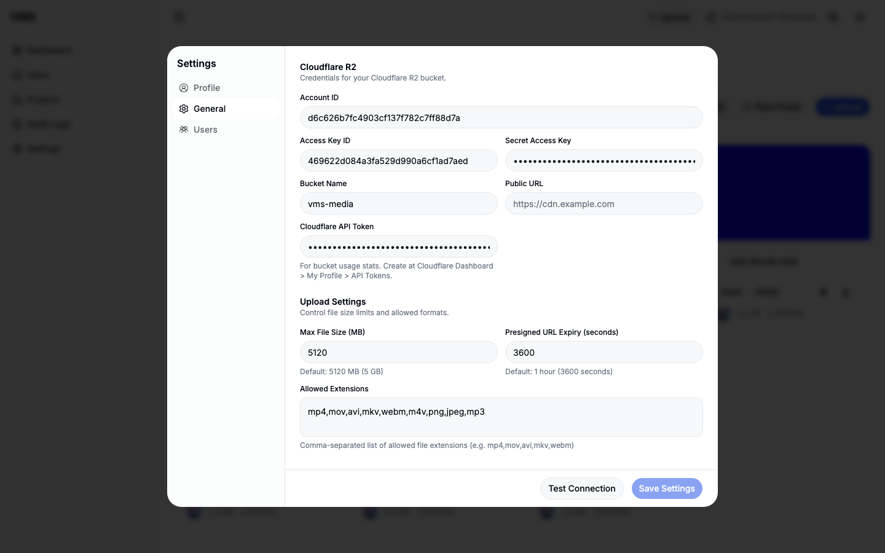

# VMS - Video Management Solution

[](https://github.com/BuildWithHussain/vms/actions/workflows/ci.yml)
[](https://github.com/BuildWithHussain/vms/actions/workflows/ui-tests.yml)

A video management application built on [Frappe](https://frappeframework.com) with a React frontend. Upload, organize, review, and deliver video assets for your team.



## Features

- **Project Management** — Organize assets into projects with status tracking and due dates
- **Direct-to-R2 Uploads** — Upload files directly to Cloudflare R2 with presigned URLs, progress tracking, retry on failure, and drag-and-drop support
- **Folder System** — Organize assets within projects using folders with drag-and-drop between them
- **Video Review** — Timestamped comments, threaded replies, drawing annotations (Fabric.js), and public review links via shareable tokens
- **Thumbnail Generation** — Automatic thumbnail extraction from videos using FFmpeg and image resizing with Pillow
- **Asset Categories** — Classify assets as Asset, For Review, or Deliverable with filtered tab views
- **Audit Logs** — Track uploads, downloads, renames, and deletions with user attribution
- **User Management** — Invite team members with the Video Manager role; profile and settings management
- **Dark Mode** — System-aware theme toggle

## Screenshots

### Projects



### Project Detail (Assets with Thumbnails)



### Upload Dialog



### Settings (R2 Configuration)



## Installation

```bash
cd $PATH_TO_YOUR_BENCH
bench get-app https://github.com/BuildWithHussain/vms --branch develop
bench --site your-site.localhost install-app vms
bench build
bench --site your-site.localhost migrate
```

## Configuration

### Cloudflare R2 Setup

VMS stores all media files in a Cloudflare R2 bucket. You need to configure R2 credentials before uploading.

1. **Create an R2 bucket** in your [Cloudflare Dashboard](https://dash.cloudflare.com) (e.g. `vms-media`)

2. **Create R2 API tokens** at Cloudflare Dashboard > R2 > Manage R2 API Tokens:
   - Create a token with **Object Read & Write** permission for your bucket
   - Note the **Access Key ID** and **Secret Access Key**

3. **Configure VMS** by navigating to Settings > General in the VMS app (or via Frappe desk at VMS Settings):

   | Field | Description |
   |-------|-------------|
   | Account ID | Your Cloudflare account ID (found in dashboard URL) |
   | Access Key ID | R2 API token access key |
   | Secret Access Key | R2 API token secret |
   | Bucket Name | Your R2 bucket name (e.g. `vms-media`) |
   | Public URL | *(Optional)* Custom domain or R2 public bucket URL for CDN access |
   | Cloudflare API Token | *(Optional)* For bucket usage stats — create at My Profile > API Tokens |

4. Click **Test Connection** to verify your credentials

### Upload Settings

In the same General settings tab you can configure:

- **Max File Size (MB)** — Default: 5120 MB (5 GB)
- **Presigned URL Expiry** — Default: 3600 seconds (1 hour)
- **Allowed Extensions** — Comma-separated list (e.g. `mp4,mov,avi,mkv,webm`)

### FFmpeg (for Thumbnails)

VMS uses FFmpeg to extract video thumbnails. Install it on your server:

```bash
# Ubuntu/Debian
sudo apt-get install ffmpeg

# macOS
brew install ffmpeg
```

## Development

### Frontend

```bash
cd apps/vms/frontend
yarn install
yarn dev       # Vite dev server on localhost:8080
yarn build     # Build to vms/public/frontend/
yarn lint      # ESLint
```

### Backend

```bash
bench start                                    # Start dev server
bench --site your-site run-tests --app vms     # Run unit tests
bench --site your-site migrate                 # Run migrations
```

### E2E Tests (Playwright)

```bash
cd apps/vms
npm install
npx playwright install --with-deps chromium
npx playwright test                            # Run all E2E tests
npx playwright test --ui                       # Interactive UI mode
```

### Code Quality

```bash
pre-commit install          # Set up hooks (first time)
pre-commit run --all-files  # Run ruff, eslint, prettier
```

## Contributing

This app uses `pre-commit` for code formatting and linting. Please [install pre-commit](https://pre-commit.com/#installation) and enable it for this repository:

```bash
cd apps/vms
pre-commit install
```

## License

AGPL-3.0
